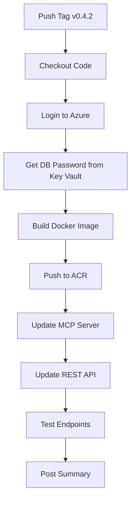

# CI/CD Setup for Azure Deployment

Automated deployment to Azure Container Apps using GitHub Actions.

## Overview

The workflow automatically deploys to Azure when you push a version tag:

```bash
git tag v0.4.2
git push origin v0.4.2
# GitHub Actions automatically builds, pushes, and deploys
```

## One-Time Setup

### 1. Create Azure Service Principal

The service principal allows GitHub Actions to deploy to your Azure subscription:

```bash
# Create service principal with contributor access to resource group
az ad sp create-for-rbac \
  --name "github-eu-regulations-deployer" \
  --role contributor \
  --scopes /subscriptions/96081c7f-5183-41a0-8cf9-0500505b6c69/resourceGroups/rg-ansvar-dev \
  --sdk-auth

# Output will look like:
# {
#   "clientId": "12345678-1234-1234-1234-123456789abc",
#   "clientSecret": "abcdefghijklmnopqrstuvwxyz123456",
#   "subscriptionId": "96081c7f-5183-41a0-8cf9-0500505b6c69",
#   "tenantId": "87654321-4321-4321-4321-cba987654321",
#   "activeDirectoryEndpointUrl": "https://login.microsoftonline.com",
#   "resourceManagerEndpointUrl": "https://management.azure.com/",
#   ...
# }
```

**⚠️ IMPORTANT:** Save this JSON - you can't retrieve it again!

### 2. Add GitHub Secret

1. Go to your GitHub repository
2. Navigate to **Settings** → **Secrets and variables** → **Actions**
3. Click **New repository secret**
4. Name: `AZURE_CREDENTIALS`
5. Value: Paste the entire JSON output from step 1
6. Click **Add secret**

### 3. Optional: Create Production Environment

For extra protection, create a production environment with approvals:

1. Go to **Settings** → **Environments**
2. Click **New environment**
3. Name: `production`
4. Enable **Required reviewers**
5. Add yourself (or your team) as reviewers

Now deployments will wait for manual approval before proceeding.

## Workflow Details

### Trigger Methods

#### 1. Automated (Recommended)

Push a version tag:

```bash
# Make changes
git add .
git commit -m "feat: updated DORA recitals"

# Create and push version tag
git tag v0.4.2
git push origin v0.4.2

# GitHub Actions automatically:
# ✅ Builds Docker image (tagged with v0.4.2 and latest)
# ✅ Pushes to ansvardev.azurecr.io
# ✅ Updates eu-regulations-mcp container
# ✅ Updates eu-regulations-api container
# ✅ Tests both endpoints
# ✅ Posts deployment summary
```

#### 2. Manual (Fallback)

Trigger from GitHub UI:

1. Go to **Actions** tab
2. Select **Deploy to Azure** workflow
3. Click **Run workflow**
4. Select branch and environment
5. Click **Run workflow**

### What It Does



### Environment Variables

All configuration is in `.github/workflows/deploy-azure.yml`:

```yaml
env:
  RESOURCE_GROUP: rg-ansvar-dev
  REGISTRY_NAME: ansvardev
  CONTAINER_ENV: cae-ansvar-dev
  MCP_APP: eu-regulations-mcp
  API_APP: eu-regulations-api
  DB_NAME: psql-ansvar-dev
  DB_ADMIN: ansvaradmin
  DB_DATABASE: eu_regulations
```

### Secrets Used

| Secret | Source | Purpose |
|--------|--------|---------|
| `AZURE_CREDENTIALS` | Service principal (setup above) | Authenticate to Azure |
| `kv-ansvar-dev/postgres-password` | Azure Key Vault | Database connection |

## Usage

### Regular Updates

```bash
# 1. Make your changes
vim src/tools/search.ts

# 2. Commit
git add .
git commit -m "fix: improved search ranking"

# 3. Create version tag
git tag v0.4.3
git push origin v0.4.3

# 4. Monitor deployment
# → https://github.com/Ansvar-Systems/EU_compliance_MCP/actions

# 5. Test once deployed
curl https://eu-regulations-mcp.jollysea-916ea475.westeurope.azurecontainerapps.io/health
```

### Rollback

If a deployment breaks:

```bash
# Find previous working tag
git tag -l

# Re-deploy previous version
git push origin v0.4.2

# Or manually update containers to previous image
az containerapp update \
  --name eu-regulations-mcp \
  --resource-group rg-ansvar-dev \
  --image ansvardev.azurecr.io/eu-regulations:v0.4.2
```

## Deployment Time

| Step | Duration |
|------|----------|
| Build Docker image | ~3-5 min |
| Push to ACR | ~1-2 min |
| Update containers | ~30 sec |
| **Total** | **~5-8 min** |

## Troubleshooting

### Workflow Fails at "Azure Login"

**Cause:** `AZURE_CREDENTIALS` secret is missing or invalid.

**Fix:**
1. Re-run the service principal creation command (see Setup step 1)
2. Update the `AZURE_CREDENTIALS` secret in GitHub

### Workflow Fails at "Get Database Password"

**Cause:** Service principal doesn't have access to Key Vault.

**Fix:**
```bash
# Grant service principal read access to Key Vault
az keyvault set-policy \
  --name kv-ansvar-dev \
  --object-id <SERVICE_PRINCIPAL_OBJECT_ID> \
  --secret-permissions get list
```

To get the service principal object ID:
```bash
az ad sp list --display-name "github-eu-regulations-deployer" --query [0].id -o tsv
```

### Containers Don't Update

**Cause:** Azure Container Apps may cache the `latest` tag.

**Fix:** Force pull new image:
```bash
az containerapp update \
  --name eu-regulations-mcp \
  --resource-group rg-ansvar-dev \
  --image ansvardev.azurecr.io/eu-regulations:latest
```

### Health Checks Fail

**Cause:** Containers are cold starting (scale-to-zero).

**Expected:** First request after scale-to-zero takes 2-3 seconds. Workflow waits 10 seconds, but may still catch cold start.

**Not a problem:** Azure will retry health checks. Check again after 30 seconds:
```bash
curl https://eu-regulations-mcp.jollysea-916ea475.westeurope.azurecontainerapps.io/health
```

## Monitoring

### GitHub Actions

View deployment logs:
1. Go to **Actions** tab
2. Click on workflow run
3. Click on **deploy** job
4. Expand steps to see detailed logs

### Azure Portal

1. **Container Apps:**
   - https://portal.azure.com/#@ansvar.eu/resource/subscriptions/96081c7f-5183-41a0-8cf9-0500505b6c69/resourceGroups/rg-ansvar-dev/providers/Microsoft.App/containerApps/eu-regulations-mcp

2. **Container Registry:**
   - https://portal.azure.com/#@ansvar.eu/resource/subscriptions/96081c7f-5183-41a0-8cf9-0500505b6c69/resourceGroups/rg-ansvar-dev/providers/Microsoft.ContainerRegistry/registries/ansvardev

3. **Key Vault:**
   - https://portal.azure.com/#@ansvar.eu/resource/subscriptions/96081c7f-5183-41a0-8cf9-0500505b6c69/resourceGroups/rg-ansvar-dev/providers/Microsoft.KeyVault/vaults/kv-ansvar-dev

### Container Logs

```bash
# MCP Server logs
az containerapp logs tail \
  --name eu-regulations-mcp \
  --resource-group rg-ansvar-dev \
  --follow

# REST API logs
az containerapp logs tail \
  --name eu-regulations-api \
  --resource-group rg-ansvar-dev \
  --follow
```

## Cost Impact

CI/CD automation has **zero additional cost**:
- GitHub Actions: Free for public repos (2,000 min/month private repos)
- Azure deployments: Same €5-15/month with scale-to-zero
- No extra infrastructure needed

## Comparison: Manual vs Automated

| Aspect | Manual (`deploy-reuse.sh`) | Automated (GitHub Actions) |
|--------|---------------------------|---------------------------|
| **Time** | ~8 min | ~8 min |
| **Effort** | Run script, enter password | Push tag, done |
| **Errors** | Manual typos possible | Consistent every time |
| **Audit** | Local only | Full GitHub Actions log |
| **Rollback** | Manual docker commands | Push previous tag |
| **Team** | Requires Azure CLI setup | Anyone with push access |

## Best Practices

1. **Use semantic versioning:** `v0.4.2`, `v1.0.0`, `v2.1.3`
2. **Tag after testing:** Test locally before pushing tag
3. **Monitor first deployment:** Watch Actions log for new workflows
4. **Keep `deploy-reuse.sh`:** Useful for testing and emergency deploys

## Next Steps

- ✅ Set up CI/CD (you're here!)
- 📝 Point M365 Agents Toolkit to MCP URL
- 🌐 List on PulseMCP
- 📢 LinkedIn announcement about DORA compliance
